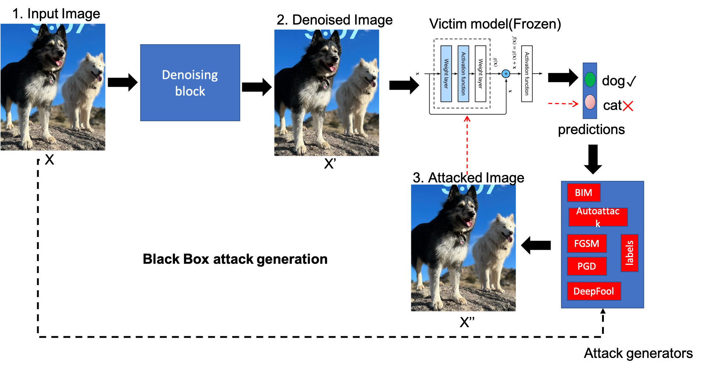

# AdversarialTensors: Tensors-based framework for adversarial robustness

This library implements a variety of tensor factorization methods for defending Artificeal intelligence 
(AI) models against adversarial attacks. The library implements three main operations. First, tensor
factorization methods are implemented as a preprocessing stage for input data to AI models to reduce the
effectiveness of adversarial noise.  In the second operation, tensor factorization methods are used to 
find novel latent attack features by combining proposed attacks from a variety of methods. Since these 
attacks will inherently be a combination of attacks many algorithms against many models, they have the 
potential to threaten a wide variety of AI models simultanioulsy In the third operation, an unsupervised
generative adversarial networks (GAN) is employed to  generate denoised data from many adversarial noises. 
This generator provides robust defense against unseen attacks. 

## Capabilites:
* Tensor factorizations with Tucker, non-negative Tucker, CPD, non-negative CPD, Tensor Train, NMF, 
NNSVD and NMF

<p align="center">
  
</p>
* Ability to denoise image single/batches/all.
<p align="center">
  
</p>
* Employs attacks such as AutoAttack, FGSM, PGD, BIM, DeepFool. 
* Ability to perform white-box/black-box attacks.

<p float="center">
  
  
</p>

* Ability to perform adversarial training.

<p float="center">
  
  
</p>

* Works on Cifar10/Cifar100/Imagenet/Tiny-Imagenet/MNIST/Fashion-MNIST. 


# End-to-End Code Execution Guide

## 1. Training Models

First, set the environment variables specific to your experiment in `send_train_jobs.sh`.

### Output:

- Models will be stored in `my_checkpoints`. For example: `my_checkpoints/cifar10/resnet18_0_1.ckpt`
- If using CSVLogger, log data will be saved in `log_{dataset_name}_{model_name}_test/{fold_ind}_{nfolds}`

### To Run:

```bash
bash send_train_jobs.sh
```

## 2. Generating Attack Data

Set the environment variables for the experiment in `send_attack_jobs.sh`.

### Output:

- Attack data and logs will be stored in `attack_log_{dataset_name}/{model_name}/{fold_ind}_{nfolds}_{attack_type}`

### To Run:

```bash
bash send_attack_jobs.sh
```

## 3. Parameter Tuning

Set the environment variables for the experiment in `send_tune_jobs.sh`.

### Output:

- The tuning results will be located at `parameter_search_{dataset_name}/{model_name}/{fold_ind}_{nfolds}_{attack_type}/search_results`

### To Run:

```bash
bash send_tune_jobs.sh
```

## 4. Collecting Results

After setting the environment variables:

### Output:

- The results will be stored as CSV files in `tune_csv_results`

### To Run:

```bash
bash collect_results.sh
```

## 5. Final Evaluation on Test Set

### Generating Attacks

- Set `final_test_set` to `True` in `send_attack_jobs.sh`

```bash
bash send_attack_jobs.sh
```

### Evaluating Models

- After setting specific environment variables (such as `eval_top_k`):

### To Run:

```bash
bash send_final_eval_jobs.sh
```

## Authors

* [Manish Bhattarai](mailto:ceodspspectrum@lanl.gov) - Los Alamos National Laboratory
* [Mehmet Kaymak Cagri](mailto:mehmet@lanl.gov) - Los Alamos National Laboratory
* [Ben Nebgen](mailto:bnebgen@lanl.gov) - Los Alamos National Laboratory
* [Boian Alexandrov](mailto:boian@lanl.gov) - Los Alamos National Laboratory
* [Kim Rasmussen](mailto:kor@lanl.gov) - Theoretical Division, Los Alamos National Laboratory

## How to cite pyDNMFk?

```latex
  @article{bhattarai2023robust,
  title={Robust Adversarial Defense by Tensor Factorization},
  author={Bhattarai, Manish and Kaymak, Mehmet Cagri and Barron, Ryan and Nebgen, Ben and Rasmussen, Kim and Alexandrov, Boian},
  journal={arXiv preprint arXiv:2309.01077},
  year={2023}
}
```


## Acknowledgments
Los Alamos National Lab (LANL), T-1

## Copyright Notice
© (or copyright) 2023. Triad National Security, LLC. All rights reserved.
This program was produced under U.S. Government contract 89233218CNA000001 for Los Alamos
National Laboratory (LANL), which is operated by Triad National Security, LLC for the U.S.
Department of Energy/National Nuclear Security Administration. All rights in the program are
reserved by Triad National Security, LLC, and the U.S. Department of Energy/National Nuclear
Security Administration. The Government is granted for itself and others acting on its behalf a
nonexclusive, paid-up, irrevocable worldwide license in this material to reproduce, prepare
derivative works, distribute copies to the public, perform publicly and display publicly, and to permit
others to do so.


## License

This program is open source under the BSD-3 License.
Redistribution and use in source and binary forms, with or without
modification, are permitted provided that the following conditions are met:

1. Redistributions of source code must retain the above copyright notice, this
   list of conditions and the following disclaimer.

2. Redistributions in binary form must reproduce the above copyright notice,
   this list of conditions and the following disclaimer in the documentation
   and/or other materials provided with the distribution.

3. Neither the name of the copyright holder nor the names of its
   contributors may be used to endorse or promote products derived from
   this software without specific prior written permission.

THIS SOFTWARE IS PROVIDED BY THE COPYRIGHT HOLDERS AND CONTRIBUTORS "AS IS"
AND ANY EXPRESS OR IMPLIED WARRANTIES, INCLUDING, BUT NOT LIMITED TO, THE
IMPLIED WARRANTIES OF MERCHANTABILITY AND FITNESS FOR A PARTICULAR PURPOSE ARE
DISCLAIMED. IN NO EVENT SHALL THE COPYRIGHT HOLDER OR CONTRIBUTORS BE LIABLE
FOR ANY DIRECT, INDIRECT, INCIDENTAL, SPECIAL, EXEMPLARY, OR CONSEQUENTIAL
DAMAGES (INCLUDING, BUT NOT LIMITED TO, PROCUREMENT OF SUBSTITUTE GOODS OR
SERVICES; LOSS OF USE, DATA, OR PROFITS; OR BUSINESS INTERRUPTION) HOWEVER
CAUSED AND ON ANY THEORY OF LIABILITY, WHETHER IN CONTRACT, STRICT LIABILITY,
OR TORT (INCLUDING NEGLIGENCE OR OTHERWISE) ARISING IN ANY WAY OUT OF THE USE
OF THIS SOFTWARE, EVEN IF ADVISED OF THE POSSIBILITY OF SUCH DAMAGE.
