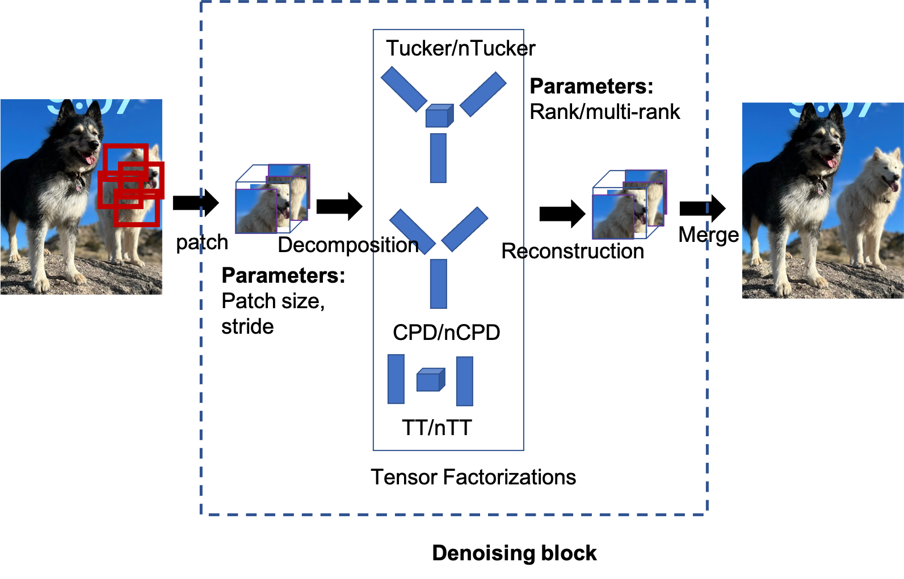
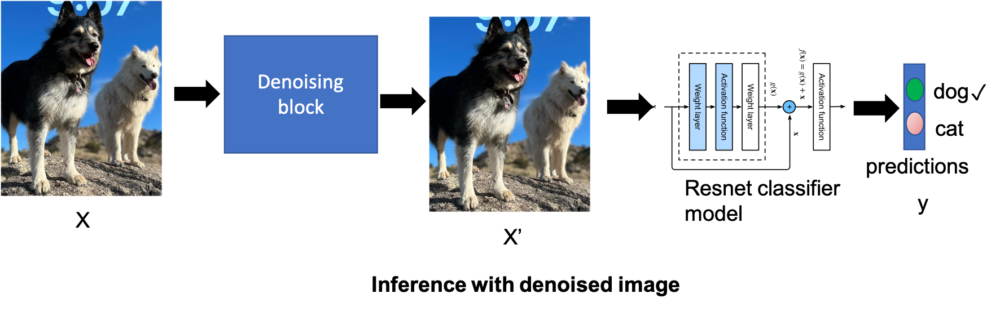
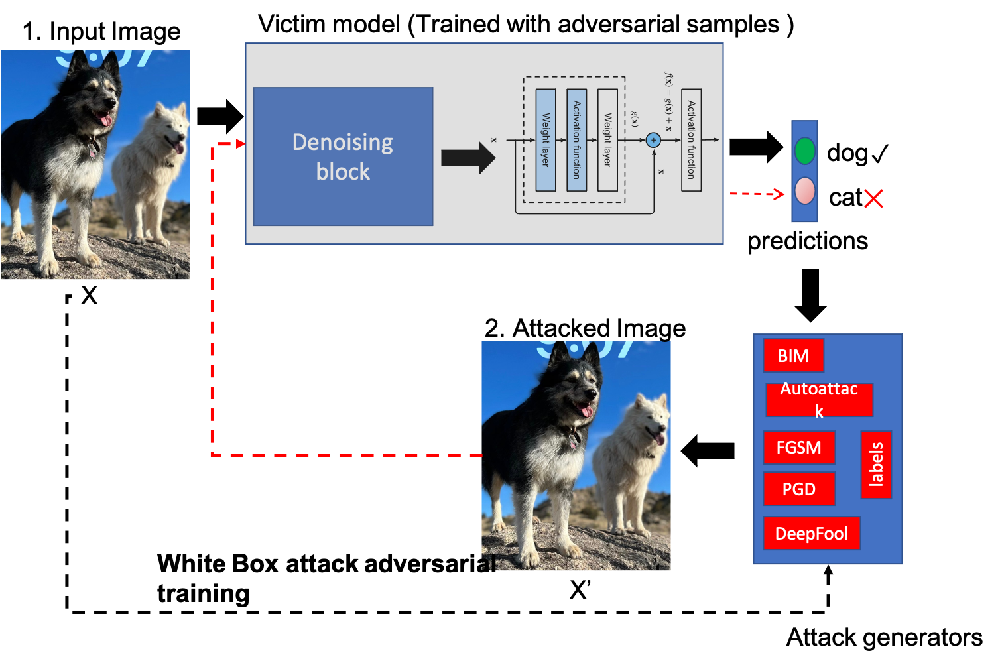
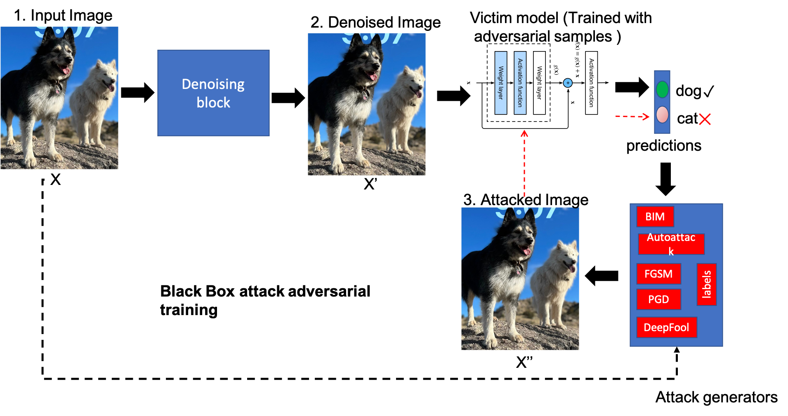

.. AdversarialTensors documentation master file, created by
   sphinx-quickstart on Wed Sep 13 11:27:50 2023.
   You can adapt this file completely to your liking, but it should at least
   contain the root `toctree` directive.

Welcome to AdversarialTensors's documentation!
==============================================

Overview
--------

This library implements a variety of tensor factorization methods for defending Artificial Intelligence (AI) models against adversarial attacks.

The library provides the following main functionalities:

1. Preprocessing stage that uses tensor factorization methods to reduce adversarial noise.
2. Identifying novel latent attack features by combining different attack methods.
3. Employing Generative Adversarial Networks (GANs) to generate denoised data.

Capabilities
------------

- Tensor factorizations methods like Tucker, non-negative Tucker, CPD, non-negative CPD, Tensor Train, NMF, NNSVD and NMF.

- Ability to denoise image in various modes: single, batch, and all.

- Attacks such as AutoAttack, FGSM, PGD, BIM, DeepFool.
- White-box and black-box attack capabilities.

- Ability to perform adversarial training.

- Support for datasets: Cifar10, Cifar100, Imagenet, Tiny-Imagenet, MNIST, Fashion-MNIST.

End-to-End Code Execution Guide
-------------------------------

Training Models
^^^^^^^^^^^^^^^

First, set the environment variables specific to your experiment in ``send_train_jobs.sh``.

Output:
  - Models will be stored in ``my_checkpoints``. For example: ``my_checkpoints/cifar10/resnet18_0_1.ckpt``
  - If using CSVLogger, log data will be saved in ``log_{dataset_name}_{model_name}_test/{fold_ind}_{nfolds}``

To Run:

.. code-block:: bash

   bash send_train_jobs.sh

Generating Attack Data
^^^^^^^^^^^^^^^^^^^^^^

Set the environment variables for the experiment in ``send_attack_jobs.sh``.

Output:
  - Attack data and logs will be stored in ``attack_log_{dataset_name}/{model_name}/{fold_ind}_{nfolds}_{attack_type}``

To Run:

.. code-block:: bash

   bash send_attack_jobs.sh

Parameter Tuning
^^^^^^^^^^^^^^^^

Set the environment variables for the experiment in ``send_tune_jobs.sh``.

Output:
  - The tuning results will be located at ``parameter_search_{dataset_name}/{model_name}/{fold_ind}_{nfolds}_{attack_type}/search_results``

To Run:

.. code-block:: bash

   bash send_tune_jobs.sh

Collecting Results
^^^^^^^^^^^^^^^^^^

After setting the environment variables:

Output:
  - The results will be stored as CSV files in ``tune_csv_results``

To Run:

.. code-block:: bash

   bash collect_results.sh

Final Evaluation on Test Set
^^^^^^^^^^^^^^^^^^^^^^^^^^^^

Generating Attacks
  - Set ``final_test_set`` to ``True`` in ``send_attack_jobs.sh``

.. code-block:: bash

   bash send_attack_jobs.sh

Evaluating Models
  - After setting specific environment variables (such as ``eval_top_k``):

To Run:

.. code-block:: bash

   bash send_final_eval_jobs.sh

.. toctree::
   :maxdepth: 2
   :caption: Contents:

Indices and tables
==================

* :ref:`genindex`
* :ref:`modindex`
* :ref:`search`
